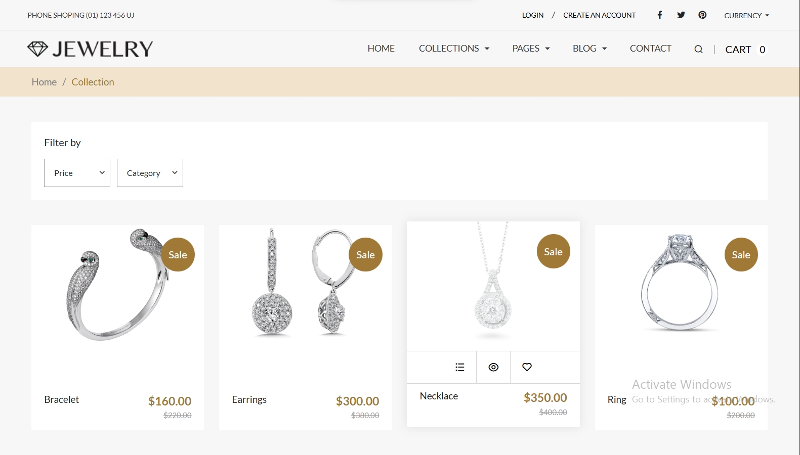
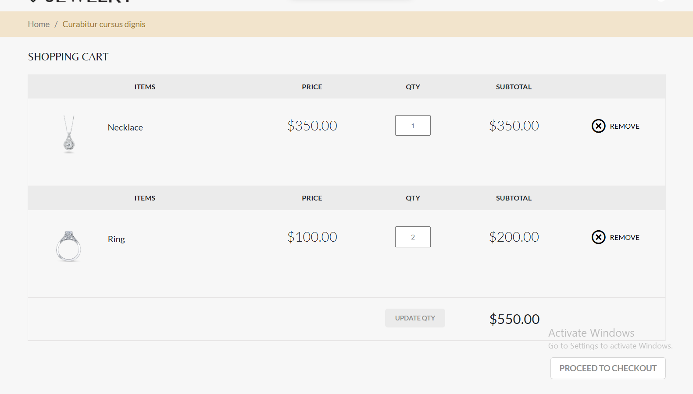
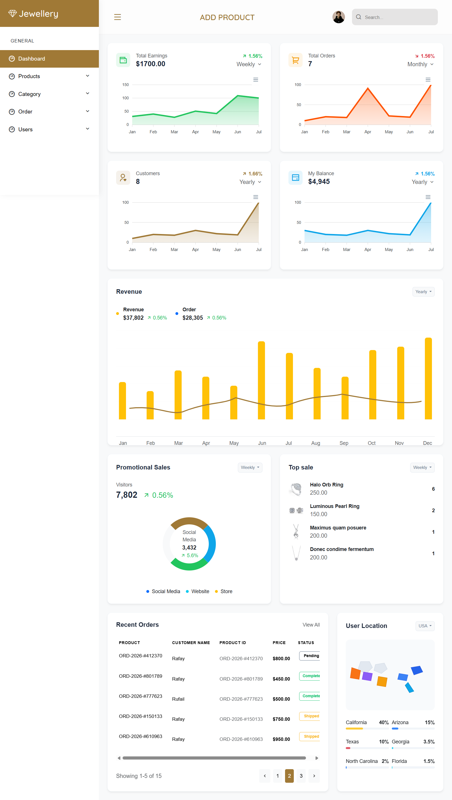

# 🛒 PHP E-Commerce Website

A fully functional E-Commerce Web Application developed using Core PHP and MySQL. The project provides a complete online shopping experience with secure authentication, email verification, shopping cart functionality, order management, advanced filtering, and a comprehensive admin dashboard.

The application follows secure development practices using PDO prepared statements, input validation, session-based authentication, and role-based authorization.

## 🔗 Live Link

👉 https://jewelleryshop.infinityfreeapp.com/

---

## ✨ Features

### 🔐 Authentication & Authorization

- User Registration
- Email Verification
- Secure Login & Logout
- Forgot Password & Password Reset
- Role-Based Access Control (Admin/User)
- Session-Based Authentication
- Route Protection & Authorization
- Input Validation
- PDO Prepared Statements for SQL Injection Protection

### 🛍️ E-Commerce Functionality

- Product Listing
- Product Details Page
- Product Image Upload
- Add to Cart
- Session-Based Shopping Cart
- Checkout System
- Product Search
- Category Filtering
- Price Sorting (Low to High / High to Low)
- Order Placement

### 📦 Order Management

- Order Processing
- Pending Orders
- Shipped Orders
- Delivered Orders
- Automated Shipment Email Notifications

### 👨‍💼 Admin Dashboard

- Dashboard Overview
- Total Orders Statistics
- Total Revenue Statistics
- Total Customers Statistics
- Top Selling Products
- Recent Orders Overview
- Product Management (CRUD)
- Category Management (CRUD)
- Order Management
- User Management

### 🌐 Website Pages

- Home
- Collections
- About
- Pricing
- FAQs
- Testimonials
- Blog Grid
- Contact

### 📱 User Experience

- Fully Responsive Design
- Mobile Friendly Layout
- Clean User Interface
- Easy Navigation

---

## 🛠️ Tech Stack

### Frontend

- HTML5
- CSS3
- Bootstrap
- JavaScript

### Backend

- Core PHP
- MySQL

### Additional Tools

- PHPMailer
- Session Management
- Email Verification System

---

## 👥 User Roles

### Admin

- Manage Products
- Manage Categories
- Manage Users
- Manage Orders
- Monitor Store Statistics

### User

- Register Account
- Verify Email
- Browse Products
- Add Products to Cart
- Place Orders

---

## 🔒 Security Features

- PDO Prepared Statements
- SQL Injection Protection
- Input Validation & Sanitization
- Session-Based Authentication
- Role-Based Authorization
- Protected Admin Routes

---

## 📸 Screenshots

### Home Page


### Product Listing



### Shopping Cart



### Admin Dashboard



---

## ⚙️ Installation

### Clone Repository

```bash
git clone https://github.com/AbdulRafay901/Ecommerce-Website.git
```

### Configure Database

1. Create a MySQL database.
2. Import the SQL file.
3. Update database credentials.

```php
try {

        $server = "mysql:host=localhost:3307;dbname=your_database_name";
        $username = "root";
        $password = "";

        $conn = new PDO($server, $username, $password);
    }
catch (PDOException $e) {
        echo "Database Error: " . $e->getMessage();
    }
```

### Run Project

1. Start Apache and MySQL.
2. Place project inside htdocs.
3. Open browser.

```bash
http://localhost/project-folder
```

---

## 🔮 Future Enhancements

- Inventory Management
- User Profile Management
- Pagination
- Dashboard Analytics Charts
- Wishlist System
- Payment Gateway Integration

---

## 🎯 Learning Outcomes

This project helped strengthen practical experience in:

- Core PHP Development
- Authentication Systems
- Authorization & Security
- Session Management
- CRUD Operations
- Database Design
- E-Commerce Workflow Implementation
- Admin Dashboard Development
- Search & Filtering Systems

---

## 📄 License

This project is developed for educational and portfolio purposes.
